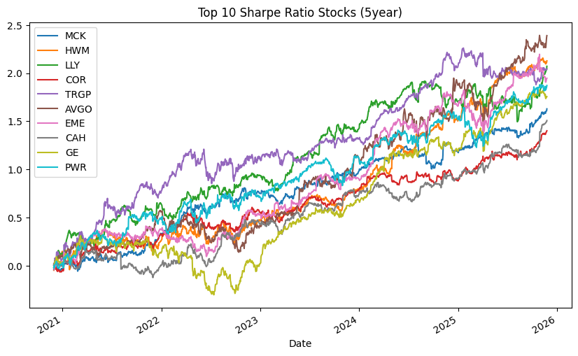

# S&P 500 Stock Quantitative Analysis
## Overview

This project implements a proof of concept of a quantitative equity selection and portfolio construction model using historical closing price data pulled from Yahoo Finance. My main objective is to identify stocks with low risk and high returns by combining returns, volatility, drawdown, and Sharpe Ratio metrics aross multiple time horizons. 

Utilized the open-source yfinance library and sent a batch request for 5 years (ranging from 11-27-2020 to 11-25-2025) worth of historical adjusted close price data for 503 tickers. I received back 1255 total trading days in return which was used for the basis of my time series analysis. 

## Key Features

* Multi-horizon analysis (1M, 3M, 6M, 9M, 1 Year, 2 Year, 3 Year, 4 Year, 5 Year)
* Cumalative logarithmic returns calculated
* Risk-adjusted evaluation using Sharpe ratios
* Downside risk control via volatility and max drawdown
* Various custom functions filter out volatile and risky stocks and keeps stocks with high returns and ideal Sharpe ratios
* Output is watchlist of stocks to keep an eye out for long-term investments

## Results 

Criteria for my watchlist was that for the given window of time the stocks with the highest returns were compared to the stocks with the highest Sharpe ratios and only kept the tickers that appeared on the Sharpe ratio list. Then I would compare that list with stocks that were over 25% in volatility and experienced a drawdown of over 50%. If the tickers appeared anywhere on these lists I would drop them as well. 

My output was a list of 50 stocks spread out between the 9 separate windows of time. To further reduce the list, I filtered for the ones with timeframes between 3-5 years and Sharpe ratios of greater than 1. This resulted in 11 stocks for my potential watchlist. 

The takeaway is that health care is overrepresented in my Portfolio watchlist. Volatility rates are between 20-24% with drawdowns of 15-24%, Sharpe ratios above 1, and returns anywhere from about 150 to 400%. The Line Plot below were the top 10 stocks with the best Sharpe ratios over 5 years. A few of my watchlist tickers can be found here. 

